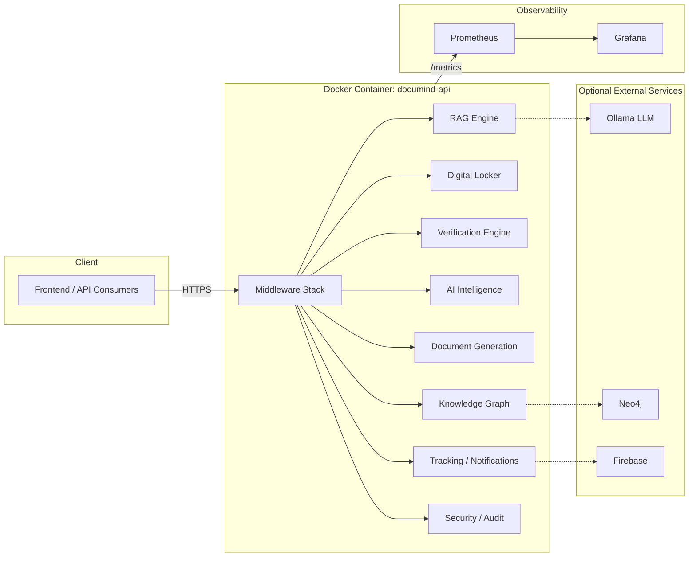

# DocuMind AI Backend — Deployment Guide

## 1. Architecture at a Glance



The backend is a single FastAPI process (`main.py`) that lazily wires up 8 domain subsystems at startup (auth, Digital Locker, Verification Engine, AI Intelligence, Document Generation, Knowledge Graph, Tracking/Notifications, Security). Every subsystem's initialisation is wrapped in its own `try/except` — a missing optional dependency (e.g. `spacy`, `torch`, Neo4j, Firebase) degrades that one feature instead of preventing the whole process from starting. Verified live in this hardening pass — see `TEST_REPORT.md`.

## 2. Running Locally Without Docker (fastest path to `/docs`)

For local development/inspection you don't need Docker at all:

```bash
pip install -r requirements.txt
python -m spacy download en_core_web_sm   # optional, enables Knowledge Graph NER
# Install Tesseract OCR (optional, enables real OCR text extraction):
#   Windows: winget install --id UB-Mannheim.TesseractOCR -e
#   macOS:   brew install tesseract
#   Linux:   apt-get install tesseract-ocr

cp .env.example .env   # then fill in JWT_SECRET_KEY, AADHAAR_HMAC_KEY, DIGILOCKER_MASTER_KEY (see below)
uvicorn main:app --reload --port 8000
```

Then open **http://localhost:8000/docs** for Swagger UI, or **http://localhost:8000/health** to confirm liveness.

On Windows, two convenience scripts start/stop the server as a detached background process (useful when driving the app from a script or CI-like shell that needs its terminal back immediately):
```powershell
.\scripts\dev_start_server.ps1   # writes uvicorn_out.log / uvicorn_err.log / uvicorn.pid
.\scripts\dev_stop_server.ps1
```

**Generating the three required secrets** (`DIGILOCKER_MASTER_KEY` must be base64, *not* raw hex — mixing this up is a common mistake that disables the Digital Locker subsystem with a `binascii.Error: Incorrect padding`):
```bash
python -c "import secrets; print(secrets.token_hex(32))"                                  # JWT_SECRET_KEY / AADHAAR_HMAC_KEY
python -c "import base64, os; print(base64.urlsafe_b64encode(os.urandom(32)).decode())"   # DIGILOCKER_MASTER_KEY
```

> **NumPy 2.x / FAISS compatibility note:** `requirements.txt` pins `faiss-cpu>=1.8.0`. If you ever see `AttributeError: _ARRAY_API not found` or `ImportError: numpy.core.multiarray failed to import` at startup, an older cached `faiss-cpu` wheel (pre-1.8.0, built against NumPy 1.x) got installed — run `pip install --upgrade faiss-cpu` to fix it. This was found and fixed during runtime verification; see `TEST_REPORT.md` §7.

> **Rotating `AADHAAR_HMAC_KEY` or `JWT_SECRET_KEY`?** Delete `auth_store.json` first (or restore it from a backup taken under the *same* key). Aadhaar numbers and other values are HMAC'd with these keys before storage — rotating the key without clearing/re-seeding the store makes existing demo/citizen records permanently unable to authenticate (they'll get a generic `401 Invalid credentials`, not an obvious key-mismatch error).

## 3. Prerequisites (Docker path)

* Docker Engine 24+ and Docker Compose v2 (`docker compose`, not the legacy `docker-compose`).
* A `.env` file in the project root (copy `.env.example` → `.env` and fill in secrets — see `SECURITY_GUIDE.md` §3).
* (Optional) An Ollama installation or API key for HuggingFace/OpenAI for LLM-backed answers. Without either, the system automatically falls back to a rule-based `LocalLLM` (still fully functional for retrieval, just less fluent for generated answers).

## 4. Running with Docker

### 4.1 Build

```bash
docker build -t documind-backend:latest .
```

The `Dockerfile` is a two-stage build:
1. **builder** — installs Python dependencies into an isolated virtualenv and pre-downloads the spaCy `en_core_web_sm` model.
2. **runtime** — a slim image with only runtime system packages (`tesseract-ocr`, `libgl1`, `curl`), running as a non-root `documind` user (uid 1000), with a container `HEALTHCHECK` against `/health`.

> **Note on verification scope:** Docker is not available in the environment used to prepare this hardening pass (no Docker daemon), so the image could not be built and run end-to-end here. The Dockerfile was reviewed line-by-line against Docker best practices (multi-stage build, pinned base image, non-root user, minimal runtime packages, `HEALTHCHECK`, `.dockerignore` to keep the build context small). **Run `docker build` once in your own environment before first deployment** and confirm `docker run --rm documind-backend:latest` starts cleanly — see the verification checklist in `TEST_REPORT.md`.

### 4.2 Run (single container)

```bash
docker run -d \
  --name documind-api \
  -p 8000:8000 \
  --env-file .env \
  -v documind_vault:/app/vault \
  -v documind_gen_keys:/app/gen_keys \
  -v documind_generated_pdfs:/app/generated_pdfs \
  -v documind_data:/app/data \
  documind-backend:latest

curl http://localhost:8000/health
```

### 4.3 Run with Docker Compose (recommended)

```bash
# API only
docker compose up -d --build

# API + local Ollama LLM
docker compose --profile llm up -d --build

# API + Neo4j-backed Knowledge Graph
docker compose --profile graph up -d --build

# API + Prometheus + Grafana
docker compose --profile monitoring up -d --build

# Everything
docker compose --profile full up -d --build
```

`docker-compose.yml` mounts named volumes for everything that must survive a redeploy (`vault/`, `gen_keys/`, `generated_pdfs/`, and a `/app/data` volume for all SQLite/JSON stores — the app resolves these paths from `AUTH_STORE_PATH`, `GEN_STORE_PATH`, `KG_STORE_PATH`, `DIGILOCKER_DB`, `VERIFICATION_DB`, `TRACKING_DB`, `AUDIT_DB_PATH`, all of which are set to `/app/data/...` in the compose file).

## 5. Configuration Reference

All configuration is environment-variable driven via `core/config.py` (Pydantic settings, `.env`-file aware). Key groups:

| Group | Variables | Notes |
|---|---|---|
| App | `APP_ENV` (`development`/`testing`/`production`), `APP_DEBUG` | `production` tightens CORS/log-level defaults and enables JSON logs. |
| Server | `API_HOST`, `API_PORT`, `WORKERS`, `PORT` (Railway/Cloud Run override) | |
| CORS | `CORS_ORIGINS` (comma-separated, or `*`) | Never `*` in production — see `SECURITY_GUIDE.md`. |
| Embedding / RAG | `EMBEDDING_MODEL`, `CHUNK_SIZE`, `TOP_K`, `SEARCH_TYPE` | |
| LLM | `HUGGINGFACE_API_KEY`, `OPENAI_API_KEY`, or a local Ollama instance | Fallback chain: Ollama → HuggingFace → rule-based `LocalLLM`. |
| OCR | `OCR_ENGINE`, `TESSERACT_CMD`, `OCR_LANGUAGE` | Tesseract binary is installed in the production image. |
| Knowledge Graph | `NEO4J_URI`, `NEO4J_USER`, `NEO4J_PASSWORD`, `KG_STORE_PATH` | Falls back to an in-memory graph persisted to `KG_STORE_PATH` if Neo4j isn't configured. |
| Auth | `JWT_SECRET_KEY`, `AADHAAR_HMAC_KEY`, `ACCESS_TOKEN_TTL_MINUTES`, `REFRESH_TOKEN_TTL_DAYS` | **Must** be rotated from defaults — see `SECURITY_GUIDE.md`. |
| Document Generation | `GEN_STORE_PATH`, `GEN_PDF_DIR`, `GEN_KEY_DIR`, `DOC_VERIFY_BASE_URL` | `DOC_VERIFY_BASE_URL` is embedded in QR codes — must be the public URL of this API. |
| Security middleware | `RATE_LIMIT_RPM`, `RATE_LIMIT_BURST`, `CSRF_ENFORCE`, `SESSION_TIMEOUT_MINUTES` | |
| Monitoring | `ENABLE_METRICS`, `METRICS_PATH` | |

Run `GET /diagnostics` after startup to see a live report of every dependency check (Python version, faiss, sentence-transformers, tesseract, Ollama, spaCy, Firebase, Neo4j, disk space) — this is the fastest way to confirm a deployment has everything it needs.

## 6. Health Checks & Kubernetes/Orchestrator Wiring

| Probe | Endpoint | Behaviour |
|---|---|---|
| Liveness | `GET /health` | **Always** returns HTTP 200 (status field reflects degraded/healthy) — use this so the orchestrator does not kill a process that's merely waiting on a slow model load. |
| Readiness | `GET /readiness` | Returns 503 until the embedding model responds to a real embed call; 200 once fully warm. |
| Docker `HEALTHCHECK` | built into the image | `curl -fsS http://localhost:8000/health`, 30s interval, 60s start period. |

Example Kubernetes probe block:
```yaml
livenessProbe:
  httpGet: { path: /health, port: 8000 }
  initialDelaySeconds: 30
  periodSeconds: 15
readinessProbe:
  httpGet: { path: /readiness, port: 8000 }
  initialDelaySeconds: 10
  periodSeconds: 10
```

## 7. Monitoring & Prometheus

`prometheus-fastapi-instrumentator` is wired into `create_app()` and exposes request-count, latency-histogram, and in-progress-request metrics at `GET /metrics` (excluded from `/health` scraping noise and hidden from the public `/docs`/OpenAPI schema).

* Scrape config: `monitoring/prometheus.yml` (used automatically by the `prometheus` service in `docker-compose.yml --profile monitoring`).
* Grafana is pre-wired with a Prometheus datasource (`monitoring/grafana/provisioning/`); import a FastAPI/Starlette community dashboard (e.g. Grafana.com dashboard ID `14282`) as a starting point, or build one against the `http_requests_total` / `http_request_duration_seconds` series exported by the instrumentator.
* Combine with `/status` and `/diagnostics` for subsystem-level (not just HTTP-level) visibility — these expose RAG/vector-DB/LLM/KG/Firebase readiness as structured JSON, suitable for a custom Prometheus exporter or a simple polling dashboard.

## 8. Backup Strategy

**What must be backed up** (everything else is either regenerable code or a cache):

| Data | Location (bare-metal) | Location (Docker Compose) | Criticality |
|---|---|---|---|
| Digital Locker vault (encrypted documents) | `vault/` | `documind_vault` volume | **Critical** — irreplaceable citizen documents. |
| Document signing keys | `gen_keys/` | `documind_gen_keys` volume | **Critical** — losing this invalidates every previously-issued document's signature. |
| Generated PDFs | `generated_pdfs/` | `documind_generated_pdfs` volume | High — regenerable from `gen_store.json` + templates, but slow to redo at scale. |
| SQLite databases (`digilocker.db`, `verification.db`, `tracking.db`, `audit.db`) | project root | `documind_data` volume | **Critical** — includes the audit trail required for compliance. |
| JSON stores (`auth_store.json`, `gen_store.json`, `kg_store.json`) | project root | `documind_data` volume | **Critical** for `auth_store.json`/`gen_store.json`; `kg_store.json` is a rebuildable cache. |
| `.env` (configuration) | project root | n/a (env vars / secret store) | High — but should live in a secrets manager, not a plain backup archive, in a mature setup. |

**Automated scripts** (added this pass): `scripts/backup.sh` / `scripts/backup.ps1` archive all of the above into a timestamped, checksummed `.tar.gz`/`.zip`, with 14-backup local retention. Run on a schedule:

```bash
# cron example: nightly at 02:00
0 2 * * * /app/scripts/backup.sh /mnt/backups >> /var/log/documind-backup.log 2>&1
```

Ship the resulting archive off-site (S3/GCS/Azure Blob) as the next pipeline step — the scripts intentionally stop at "produce a verified local archive" so you can plug in whatever object-storage CLI your environment already uses.

## 9. Recovery Procedure

1. **Stop the backend** so nothing is writing to SQLite during the restore:
   ```bash
   docker compose stop api        # or: systemctl stop documind
   ```
2. **Verify and restore** the backup archive:
   ```bash
   ./scripts/restore.sh /mnt/backups/documind-backup-20260101T020000Z.tar.gz
   ```
   The script verifies the SHA-256 checksum, takes a safety snapshot of whatever it's about to overwrite (into `.pre-restore-<timestamp>/`), then restores.
3. **Restart and verify:**
   ```bash
   docker compose start api
   curl http://localhost:8000/health
   curl http://localhost:8000/status
   curl http://localhost:8000/security/audit/verify   # confirm audit chain integrity survived the restore
   ```
4. **Spot-check** a known document: `GET /documents/{id}` and `GET /documents/{id}/download` for a document you know existed before the incident.
5. **Post-incident:** if the RSA signing keys (`gen_keys/`) were lost and could not be restored, every previously-issued document's signature will fail `GET /generate/verify/{document_number}` — this requires a formal re-issuance communication to affected citizens, not just a technical fix. This is why `gen_keys/` backup is marked **critical** above.

### Recovery Time / Point Objectives (suggested starting point — tune to your compliance requirements)

| Metric | Target |
|---|---|
| RPO (Recovery Point Objective) | ≤ 24h with nightly backups; reduce to hourly for the audit DB if regulatory requirements demand it. |
| RTO (Recovery Time Objective) | ≤ 30 minutes — restore script + container restart, assuming the backup archive is already staged locally or in fast object storage. |

## 10. Scaling Considerations

* The app is stateless at the HTTP layer but keeps rate-limiting and session-timeout state **in-process memory** — running multiple replicas behind a load balancer will give each replica its own rate-limit budget. For strict global rate limiting across replicas, move `RateLimitMiddleware`'s token buckets to Redis.
* FAISS is an in-process, single-node vector index (`storage/vector_db.py`). For horizontal scaling of the RAG subsystem beyond a single node's memory, migrate to a networked vector DB (Milvus/Qdrant/pgvector) — `VECTOR_DB_TYPE` is already an env-driven setting anticipating this.
* SQLite (`aiosqlite`) is single-writer; it comfortably serves the Digital Locker/Verification/Tracking/Audit workloads at moderate scale (see `TEST_REPORT.md` for measured throughput), but plan a PostgreSQL migration if you outgrow single-node write throughput — the `PERFORMANCE_BENCHMARK_REPORT.md` in this repo already flags the JSON-store rewrite-on-every-update pattern as the primary generation-throughput bottleneck.
* `WORKERS` (default 2 in the container `CMD`) controls Uvicorn worker processes — increase per CPU core available, keeping in mind each worker loads its own copy of the embedding model into memory.
