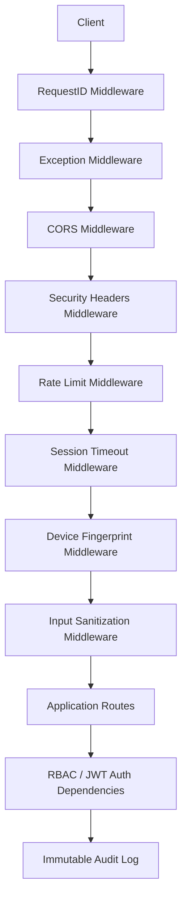

# DocuMind AI Backend — Security Guide

This document covers the security architecture of the backend, what was hardened during the production-readiness pass, known accepted risks, and the checklist to complete before a real production launch.

## 1. Security Architecture Overview



Layers, outermost first (as actually registered in `main.py` / `core/middleware.py` / `security/middleware.py`):

1. **RequestIDMiddleware** — assigns/propagates `X-Request-ID` for correlation across logs, audit entries, and client bug reports.
2. **ExceptionMiddleware** — catches unhandled exceptions, logs the full traceback server-side only, returns a generic JSON error to the client (never leaks stack traces or internals).
3. **CORSMiddleware** — configurable allow-list (`CORS_ORIGINS`); credentials are automatically disallowed when the origin list is `*`.
4. **SecurityHeadersMiddleware** — `X-Content-Type-Options: nosniff`, `X-Frame-Options: DENY`, `Referrer-Policy`, `Permissions-Policy`.
5. **RateLimitMiddleware** — per-IP token-bucket limiter (`RATE_LIMIT_RPM` / `RATE_LIMIT_BURST`), exempts `/health`, `/docs`, `/openapi.json`, `/redoc`.
6. **SessionTimeoutMiddleware** — enforces `SESSION_TIMEOUT_MINUTES` on cookie-based session state.
7. **DeviceFingerprintMiddleware** — hashes User-Agent + Accept-Language/Encoding + IP into `X-Device-Fingerprint`, used by incident detection.
8. **InputSanitizationMiddleware** — blocks SQL-injection, XSS, and path-traversal patterns in the URL path and query parameters before they reach any route handler.
9. **CSRFMiddleware** *(disabled by default, `CSRF_ENFORCE=false`)* — double-submit-cookie CSRF protection for state-changing requests; enable in production once the frontend sends `X-CSRF-Token`.
10. **RBAC / JWT auth** (`auth/rbac.py`) — per-endpoint `require_auth` / `require_role` / `require_permission` dependencies.
11. **Immutable audit log** (`security/audit.py`) — every sensitive action is recorded with a SHA-256 hash chain (tamper-evident); verify integrity anytime via `GET /security/audit/verify`.
12. **Incident detection** (`security/incidents.py`) — brute-force, device-change, geo-anomaly, off-hours, and excessive-access detection with an in-memory anomaly scorer.

## 2. What Changed During This Hardening Pass

| # | Finding | Severity | Fix |
|---|---|---|---|
| 1 | The entire `security/` package (rate limiting, CSRF, input sanitization, audit log, incident detection, consent management) was **fully implemented but never imported or registered** in `main.py` — none of it was active. | **Critical** | Wired `add_security_middleware()` into `create_app()` and registered `create_security_router()` + `init_audit_db()` in the `lifespan()` startup. All 8 `/security/*` endpoints and the full middleware stack are now live. |
| 2 | `core/middleware.py`'s `ExceptionMiddleware` referenced `get_request_id()` without importing it — **any unhandled exception in the app would itself crash with `NameError`**, producing an opaque 500 with no error body instead of the intended structured JSON error. | **Critical** | Added the missing import. Verified with a live reproduction (see `TEST_REPORT.md`). |
| 3 | `core/config.py` had `jwt_secret_key` declared on the same physical line as a long comment banner, so the field declaration was silently swallowed as part of the comment. | High | Fixed the line break; `settings.jwt_secret_key` is now a real, env-overridable Pydantic field, and production startup now warns if it's left at its default value. |
| 4 | Default rate limit (60 rpm / burst 10) was too aggressive — a single page load issuing 10+ parallel requests could be throttled. | Medium | Raised defaults to 120 rpm / burst 30 (still configurable via `RATE_LIMIT_RPM` / `RATE_LIMIT_BURST`). |
| 5 | `GET /search` (and two other scoring paths in `knowledge_graph/`) returned raw `numpy.float32` values, which FastAPI's `jsonable_encoder` cannot serialize — **any non-empty search result set returned an HTTP 500**, an availability/DoS-adjacent bug. | High | Cast all similarity scores to native `float` before returning them. Regression-tested in `tests/test_rag.py::test_search_endpoint_no_numpy_leak`. |
| 6 | `RAGAPIRouter` registered a second, unreachable `GET /health` that silently shadowed (and was shadowed by) the system `/health` endpoint — undefined behaviour in OpenAPI schema generation and a source of confusing dead code. | Medium | Renamed to `GET /rag/health`. |
| 7 | `opencv-python` (GUI build) was pinned instead of `opencv-python-headless`, which pulls in X11/GTK shared libraries that don't exist in slim container images. | Medium | Switched to `opencv-python-headless` in `requirements.txt`. |
| 8 | No dependency/static-analysis security scanning was wired into the workflow. | Medium | Ran `bandit` (SAST) and `pip-audit` (SCA) — see §4 below — and added both to `requirements-dev.txt` for ongoing use. |
| 9 | No metrics/monitoring surface existed for detecting attacks or degraded service in production. | Medium | Added Prometheus `/metrics` (hidden from public API docs) — see `DEPLOYMENT_GUIDE.md`. |

## 3. Secrets & Configuration

All secrets are environment-variable driven (`core/config.py`, `.env.example`). **Never commit a real `.env` file** — `.gitignore` has been updated to exclude `.env*` (except `.env.example`/`.env.template`), all local SQLite databases, `vault/`, `gen_keys/`, and `generated_pdfs/`.

| Variable | Purpose | Production requirement |
|---|---|---|
| `JWT_SECRET_KEY` | Signs all access/refresh tokens (HS256) | **Must** be a random 32-byte value: `python -c "import secrets; print(secrets.token_hex(32))"`. Startup now emits a warning if left at the insecure default. |
| `AADHAAR_HMAC_KEY` | HMACs Aadhaar numbers before storage (never store raw Aadhaar) | Same as above — random 32-byte value, different from `JWT_SECRET_KEY`. |
| `DIGILOCKER_MASTER_KEY` | AES-256-GCM envelope encryption key for the Digital Locker vault | **Must be set** in production — without it, a random key is generated at every process start and **all previously encrypted documents become unreadable after a restart**. |
| `CORS_ORIGINS` | Allowed browser origins | Never leave as `*` in production — set the exact frontend origin(s). |
| `CSRF_ENFORCE` | Enables CSRF double-submit validation | Set to `true` once the frontend integrates `X-CSRF-Token`. |
| `RATE_LIMIT_RPM` / `RATE_LIMIT_BURST` | Per-IP throttling | Tune to real traffic; consider a shared store (Redis) if running multiple replicas — the current limiter is in-memory per-process. |
| `FIREBASE_CREDENTIALS_PATH` | Service-account JSON for push notifications | Mount as a secret file/volume; never bake into the image. |
| `NEO4J_PASSWORD` | Graph DB credential | Required if using the Neo4j-backed Knowledge Graph profile in `docker-compose.yml`. |

## 4. Security Scan Results (this pass)

### 4.1 Static analysis — `bandit -r .` (medium+ severity)

| Finding | File(s) | Assessment |
|---|---|---|
| `B104 hardcoded_bind_all_interfaces` — binds `0.0.0.0` | `config.py`, `core/config.py` | **Accepted risk.** Required for the app to be reachable inside a container/orchestrator; the container network boundary (not the bind address) is the actual security boundary. Do not expose the container port directly to the internet — terminate TLS and access control at a reverse proxy / ingress. |
| `B608 hardcoded_sql_expressions` — f-string used to build a `WHERE` clause | `digilocker/database.py` (×4) | **False positive, verified by manual review.** The dynamic `WHERE` clause only ever concatenates hardcoded column names; every actual value is bound via `?` placeholders and passed through `params` — this is the standard safe pattern for optional-filter queries with `aiosqlite`. No user input is ever interpolated into the SQL string. |
| `B615 huggingface_unsafe_download` — `from_pretrained()` without a pinned revision | `document/classifier.py`, `embedding/model.py` | **Valid hardening recommendation, not yet applied.** Pin a specific model revision/commit hash (`from_pretrained(model_name, revision="<sha>")`) to prevent a compromised or unexpectedly-updated upstream model from being pulled silently. Tracked for a follow-up change. |
| `B113 request_without_timeout` | root-level ad-hoc `test_*.py` scripts (not the application or the `tests/` pytest suite) | Low priority — these are developer smoke-test scripts, not part of the running service. Add `timeout=` if they are kept long-term. |

### 4.2 Dependency scan — `pip-audit`

| Package | Installed | Vulnerability | Recommendation |
|---|---|---|---|
| `PyPDF2` | 3.0.1 | Known advisory (PYSEC-2026-1835) | `PyPDF2` is used in exactly one fallback code path (`document/processor.py::_extract_text_from_pdf`, behind `PyMuPDF`/`pdfplumber` as primary extractors). Recommend migrating to the actively-maintained `pypdf` successor package in a follow-up change; not blocking for launch given the limited blast radius, but should not be left indefinitely. |
| `pip` | 24.0 (tooling, not an app dependency) | Multiple advisories | The Dockerfile already runs `pip install --upgrade pip` in the builder stage, which resolves this for built images. |

Run these scans locally / in CI with:
```bash
pip install -r requirements-dev.txt
bandit -r . -x .venv,tests,test --severity-level medium
pip-audit
```

## 5. OWASP Top 10 (2021) — Coverage Summary

| Risk | Mitigation in this codebase |
|---|---|
| A01 Broken Access Control | RBAC dependencies (`auth/rbac.py`) on every sensitive route; `tests/test_auth.py` includes a regression test proving a `system_admin` cannot call an `issuing_authority`-only endpoint. |
| A02 Cryptographic Failures | AES-256-GCM for document vault, bcrypt (cost 12) for passwords, HMAC-SHA256 for Aadhaar numbers, RSA-2048 for document signing, JWT HS256 for tokens. |
| A03 Injection | Parameterized SQL everywhere (`aiosqlite` with `?` placeholders); `InputSanitizationMiddleware` blocks SQLi/XSS/path-traversal patterns at the edge; Pydantic validates all request bodies. |
| A04 Insecure Design | Defense-in-depth middleware stack; graceful degradation (a missing ML dependency degrades a feature, it does not crash the process); explicit trust-badge/manual-review workflow for verification rather than binary trust. |
| A05 Security Misconfiguration | `core/config.py::validate_required()` emits explicit startup warnings for `CORS_ORIGINS=*`, missing LLM keys, `DEBUG` logging, and (new) default `JWT_SECRET_KEY`/`AADHAAR_HMAC_KEY`/disabled CSRF in production. |
| A06 Vulnerable Components | `pip-audit` run this pass (see §4.2); add to CI going forward. |
| A07 Identification & Auth Failures | MFA (TOTP) for privileged roles, OTP for citizens, account lockout after repeated failures (`LOCKOUT_THRESHOLD`/`LOCKOUT_DURATION_MINUTES`), session TTL enforcement, refresh-token rotation. |
| A08 Software & Data Integrity | SHA-256 hash-chained audit log (tamper-evident, verifiable via `/security/audit/verify`); RSA-signed generated documents; perceptual-hash near-duplicate detection on uploads. |
| A09 Logging & Monitoring Failures | Structured logging with request-ID correlation, immutable audit trail, incident detection, Prometheus metrics (new), `/diagnostics` startup report. |
| A10 Server-Side Request Forgery | No user-controlled outbound URL fetches identified in the reviewed routers; Ollama/HuggingFace endpoints are operator-configured, not user-supplied. |

## 6. Pre-Production Security Checklist

- [ ] Set `JWT_SECRET_KEY` and `AADHAAR_HMAC_KEY` to distinct random 32-byte values.
- [ ] Set `DIGILOCKER_MASTER_KEY` and back it up securely (losing it makes all stored documents permanently unreadable).
- [ ] Set `CORS_ORIGINS` to the exact production frontend origin(s).
- [ ] Set `CSRF_ENFORCE=true` once the frontend sends `X-CSRF-Token`.
- [ ] Put the API behind TLS termination (reverse proxy / load balancer / ingress) — this backend does not terminate TLS itself.
- [ ] Rotate/remove the four demo user accounts seeded by `auth/database.py::_seed_demo_users()` (or restrict seeding to `APP_ENV=development`).
- [ ] Configure `FIREBASE_CREDENTIALS_PATH` via a mounted secret, not baked into the image.
- [ ] If running multiple replicas, move rate limiting and session state to a shared store (Redis) — the current implementation is per-process/in-memory.
- [ ] Wire `bandit` + `pip-audit` into CI (`requirements-dev.txt` already includes both).
- [ ] Review and rotate the RSA document-signing keypair (`gen_keys/`) on a defined schedule; back it up (see `DEPLOYMENT_GUIDE.md` → Backup Strategy).
- [ ] Enable `MALWARE_SCANNER=clamav` (a `MockScanner` is used by default in dev/test — see `digilocker/scanner.py`).
- [ ] Install a real Tesseract OCR binary in the runtime image/host (already added to the production `Dockerfile`); confirm `TESSERACT_CMD` is on `PATH`.
